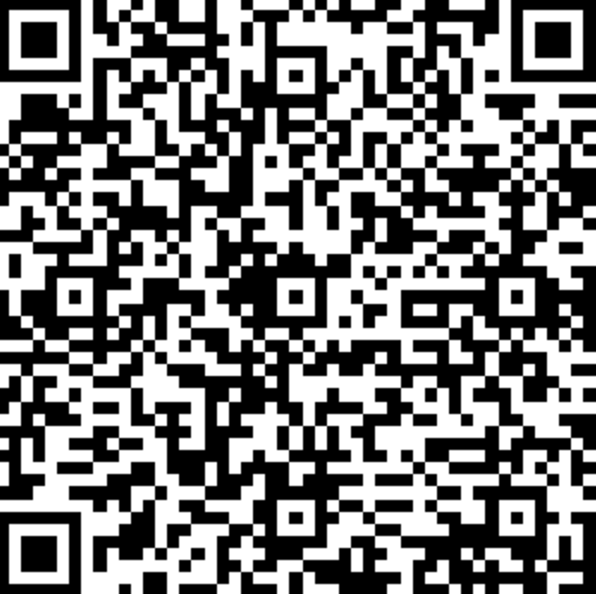
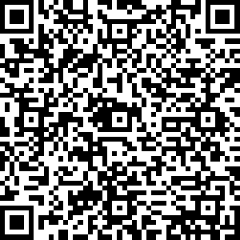
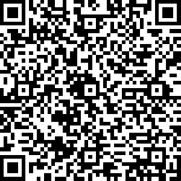
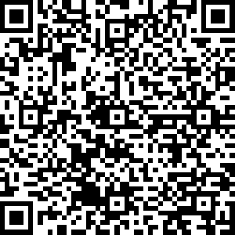

<h2>📱 扫码获取订阅</h2>

使用手机扫描对应二维码即可快速获取订阅

<table>
<tr>
<td align="center">

<b>自适应订阅</b>  

</td>

<td align="center">

<b>Base64 订阅</b>  

</td>
</tr>

<tr>
<td align="center">

<b>Clash 订阅</b>  

</td>

<td align="center">

<b>SingBox 订阅</b>  

</td>
</tr>
</table>

😅请等待一点时间

